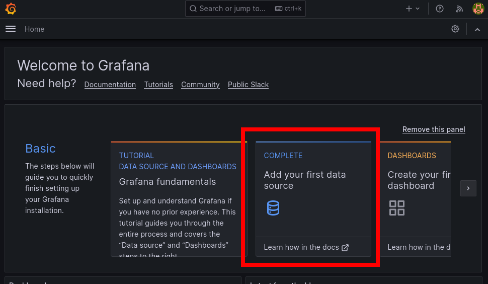
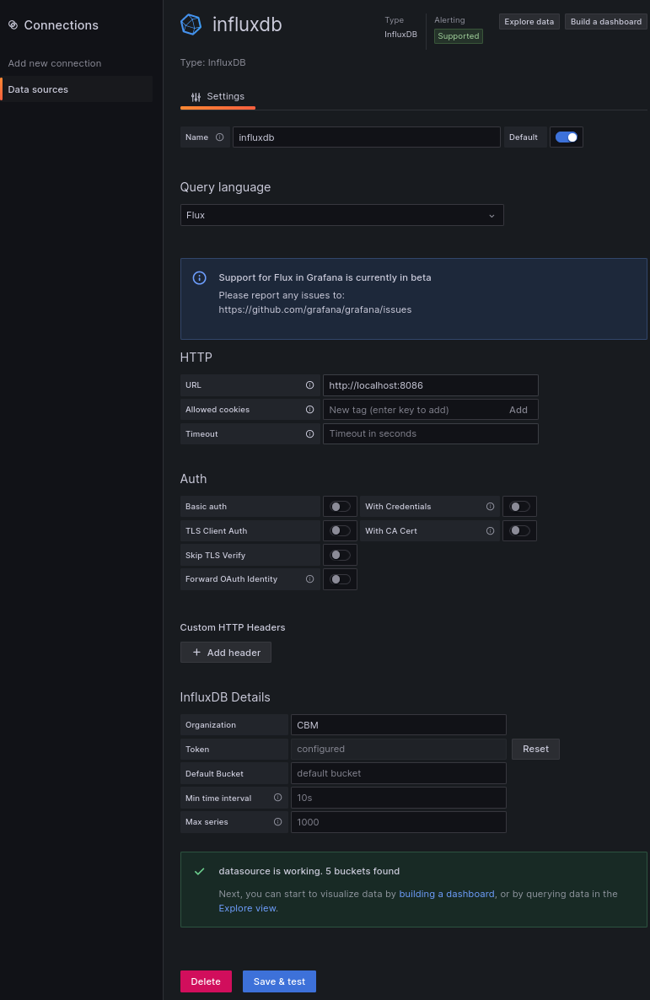
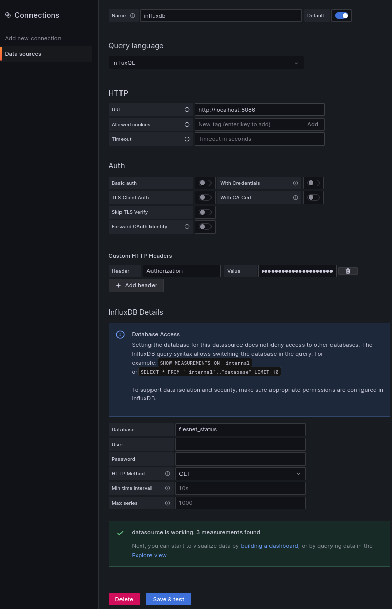

**NOTE:** The container use the `--network host` option to simplify the network access to these containers and to keep this manual short. **It is not recommended to use this flag in a production environment**

Use the known podman network capabilities to e.g. create a dedicated nework.

This manual will give you a good starting point to for local use on your development system or to create more complex container systems like e.g. pods to combine both containers.

# Prerequisities
- Working `flesnet` binary
- Manual written with `podman` version 4.3.1

# InfluxDB
This section describes how to start and initialize the InfluxDB2 container. 

Prepare our working directory and data directory:
```
mkdir -p podman_influxdb2/influxdb-data
cd podman_influxdb2
```


We will use `DOCKER_INFLUXDB_INIT_*` environment variables to let the container initialize a basic user, password, organisation and bucket. 
The initialisation works only if the provided volume directory, here `./influx-data`, is empty. Otherwise these variables will be ignored.

Start the `influxdb2` container and the initialisation by executing:
```
podman run --name=influxdb2 -p 8086:8086 -v ./influxdb-data:/var/lib/influxdb2:Z -e DOCKER_INFLUXDB_INIT_USERNAME=admin -e DOCKER_INFLUXDB_INIT_MODE=setup -e DOCKER_INFLUXDB_INIT_PASSWORD=password -e DOCKER_INFLUXDB_INIT_ORG=myorg -e DOCKER_INFLUXDB_INIT_BUCKET=mybucket --network host influxdb:latest
```

In a second terminal, access the created container by executing
```
podman exec -it influxdb2 bash
```

Within the container, we now will create a new `CBM` organisation and the buckets (databases) that will be used to store the `flesnet`, `cri`, and `tsclient` data:
```text
influx org create --name CBM
influx bucket create --org CBM --name cri_status
influx bucket create --org CBM --name tsclient_status
influx bucket create --org CBM --name flesnet_status
```

Lastly we will create an access token so we are allowed to read from and write to these buckets:
```text
# influx auth create --org CBM --all-access
root@ba8c3fc29941:/# influx auth create --org CBM --all-access
ID			Description	Token					User Name	User ID			Permissions
0c5f971a7d7c0000			PjW7daDRsi3ISDx9djctQaj8azQwE0_-q_UsJMMzM3f2eugaLBHKbyT-LPmW7D31Kj6LrghmutJr5S9odwukGA==	admin		0c5f9484ca0f6000	[read:orgs/a0f9407314587f79/authorizations write:orgs/a0f9407314587f79/authorizations read:orgs/a0f9407314587f79/buckets write:orgs/a0f9407314587f79/buckets read:orgs/a0f9407314587f79/dashboards write:orgs/a0f9407314587f79/dashboards read:/orgs/a0f9407314587f79 read:orgs/a0f9407314587f79/sources write:orgs/a0f9407314587f79/sources read:orgs/a0f9407314587f79/tasks write:orgs/a0f9407314587f79/tasks read:orgs/a0f9407314587f79/telegrafs write:orgs/a0f9407314587f79/telegrafs read:/users/0c5f9484ca0f6000 write:/users/0c5f9484ca0f6000 read:orgs/a0f9407314587f79/variables write:orgs/a0f9407314587f79/variables read:orgs/a0f9407314587f79/scrapers write:orgs/a0f9407314587f79/scrapers read:orgs/a0f9407314587f79/secrets write:orgs/a0f9407314587f79/secrets read:orgs/a0f9407314587f79/labels write:orgs/a0f9407314587f79/labels read:orgs/a0f9407314587f79/views write:orgs/a0f9407314587f79/views read:orgs/a0f9407314587f79/documents write:orgs/a0f9407314587f79/documents read:orgs/a0f9407314587f79/notificationRules write:orgs/a0f9407314587f79/notificationRules read:orgs/a0f9407314587f79/notificationEndpoints write:orgs/a0f9407314587f79/notificationEndpoints read:orgs/a0f9407314587f79/checks write:orgs/a0f9407314587f79/checks read:orgs/a0f9407314587f79/dbrp write:orgs/a0f9407314587f79/dbrp read:orgs/a0f9407314587f79/notebooks write:orgs/a0f9407314587f79/notebooks read:orgs/a0f9407314587f79/annotations write:orgs/a0f9407314587f79/annotations read:orgs/a0f9407314587f79/remotes write:orgs/a0f9407314587f79/remotes read:orgs/a0f9407314587f79/replications write:orgs/a0f9407314587f79/replications]
```

Copy your `Token`, here `PjW7daDRsi3ISDx9djctQaj8azQwE0_-q_UsJMMzM3f2eugaLBHKbyT-LPmW7D31Kj6LrghmutJr5S9odwukGA==`, and store it for later use.

All access tokens can also be listed using the `influx auth list` command.

You can now exit the container using the `exit` command.

**Note:** The influxdb container will change the permissions of the provided volume. To be able to access and remove it on the host machine again run:
```
podman unshare chmod -R 777 influxdb-data
rm -rf influxdb-data
```


# Grafana
This section describes how to start and initialize the Grafana container. 
Prepare our working directory and data directory:
```
mkdir -p podman_grafana/grafana-data
touch podman_grafana/grafana.ini
cd podman_grafana
```

Add this config to your `grafana.ini`:
```
[security]
# default admin user, created on startup
admin_user = admin

# default admin password, can be changed before first start of grafana,  or in profile settings
admin_password = admin
```


Now run the container by executing:
```
podman run -p 3000:3000 --name=grafana --user "$(id -u)" --userns=keep-id -v ./grafana.ini:/etc/grafana/grafana.ini -v ./grafana-data:/var/lib/grafana:z --network host grafana/grafana
```

Open your browser and go to `http://localhost:3000`. The login is
 - User: admin
 - PW: admin

After your first login you will be asked to change your password.

On the start screen select "Add your first data source". From the "Data sources" list select "InfluxDB"





## Using Flux as the Query Language

- Give the connection a name in the "Name" input
- Select "Flux" in theQuery Language" dropdown
- In the HTTP Section the the URL to "http://localhost:8086" (Based on the connection info of your InfluxDB container)
- Deselect everything in the "Auth" section
- In the "InfluxDB Details" section:
	- Put CBM as Organisation
	- Put in the Token you generated when setting up the InfluxDB container with its buckets (here `PjW7daDRsi3ISDx9djctQaj8azQwE0_-q_UsJMMzM3f2eugaLBHKbyT-LPmW7D31Kj6LrghmutJr5S9odwukGA==`)

Hit the "Save & test" button to test your configration.



## Using InfluxQL as the Query Language
**Note:** When using InfluxQL as the query languages requires you to set up multiple data sources for each InfluxDB bucket - this is not necessary when using "Flux" as the query language.

- Give the connection a name in the "Name" input
- Select "InfluxQL" in theQuery Language" dropdown
- In the HTTP Section the the URL to "http://localhost:8086" (Based on the connection info of your InfluxDB container)
- Click "Add header" in the "Custom HTTP Headers" section
	- Header: `Authorization`
	- Value: `Token <your token from setting up the InfluxDB container>`
- In the "InfluxDB Details" section:
	-  Database: `flesnet_status` (or `cri_status` or `tsclient_status`)
	-  HTTP Method: `GET`

Hit the "Save & test" button to test your configration.

Repeat for Databases `cri_status` and `tsclient_status`



# Connecting FLESnet and other to InfluxDB

Processes can be connected to the InfluxDB using the `-m` flag:

- `cri`:
   ```bash
   export CBM_INFLUX_TOKEN=<Auth token from configuring InfluxDB container>
   cri_status -m influx2:localhost:8086:cri_status:
   ```
  This should print a line with "Starting measurements", then just let it run silently
- `flesnet`:
 ```bash
   export CBM_INFLUX_TOKEN=<Auth token from configuring InfluxDB container>
   flesnet  [...] -m influx2:localhost:8086:flesnet_status:
   ```
- `tsclient`:
   ```bash
   export CBM_INFLUX_TOKEN=<Auth token from configuring InfluxDB container>
   tsclient [...] -m influx2:localhost:8086:tsclient_status:
   ```
